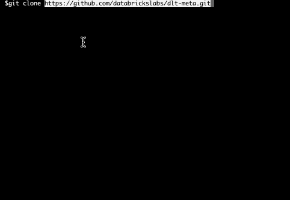
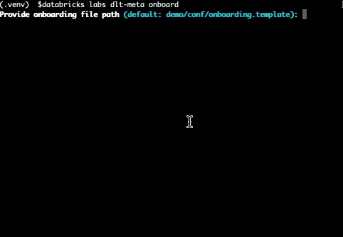
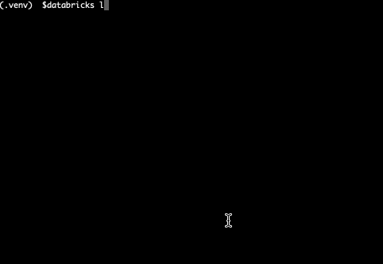

# DLT-META

<!-- Top bar will be removed from PyPi packaged versions -->
<!-- Dont remove: exclude package -->

[Documentation](https://databrickslabs.github.io/dlt-meta/) |
[Release Notes](CHANGELOG.md) |
[Examples](https://github.com/databrickslabs/dlt-meta/tree/main/examples)

<!-- Dont remove: end exclude package -->

---

<p align="left">
    <a href="https://databrickslabs.github.io/dlt-meta/">
        
    </a>
    <a href="https://pypi.org/project/dlt-meta/">
        
    </a>
    <a href="https://github.com/databrickslabs/dlt-meta/actions/workflows/onpush.yml">
        
    </a>
    <a href="https://codecov.io/gh/databrickslabs/dlt-meta">
        
    </a>
    <a href="https://pypistats.org/packages/dl-meta">
        
    </a>
    <a href="https://github.com/PyCQA/flake8">
        
    </a>
</p>

[](<[https://codecov.io/github/databrickslabs/dlt-meta](https://github.com/databrickslabs/dlt-meta)>)

---

# Project Overview
`DLT-META` is a metadata-driven framework designed to work with [Delta Live Tables](https://www.databricks.com/product/delta-live-tables). This framework enables the automation of bronze and silver data pipelines by leveraging metadata recorded in an onboarding JSON file. This file, known as the Dataflowspec, serves as the data flow specification, detailing the source and target metadata required for the pipelines.

In practice, a single generic DLT pipeline reads the Dataflowspec and uses it to orchestrate and run the necessary data processing workloads. This approach streamlines the development and management of data pipelines, allowing for a more efficient and scalable data processing workflow

### Components:

#### Metadata Interface

- Capture input/output metadata in [onboarding file](https://github.com/databrickslabs/dlt-meta/blob/main/examples/onboarding.json)
- Capture [Data Quality Rules](https://github.com/databrickslabs/dlt-meta/tree/main/examples/dqe/customers/bronze_data_quality_expectations.json)
- Capture processing logic as sql in [Silver transformation file](https://github.com/databrickslabs/dlt-meta/blob/main/examples/silver_transformations.json)

#### Generic DLT pipeline

- Apply appropriate readers based on input metadata
- Apply data quality rules with DLT expectations
- Apply CDC apply changes if specified in metadata
- Builds DLT graph based on input/output metadata
- Launch DLT pipeline

## High-Level Process Flow:


## Steps


## Getting Started

Refer to the [Getting Started](https://databrickslabs.github.io/dlt-meta/getting_started)

### Databricks Labs DLT-META CLI lets you run onboard and deploy in interactive python terminal

#### pre-requisites:

- Python 3.8.0 +

- Databricks CLI v0.213 or later. See [instructions](https://docs.databricks.com/en/dev-tools/cli/tutorial.html)

- Install Databricks CLI on macOS:
- 

- Install Databricks CLI on Windows:
- 

Once you install Databricks CLI, authenticate your current machine to a Databricks Workspace:

```commandline
databricks auth login --host WORKSPACE_HOST
```

    To enable debug logs, simply add `--debug` flag to any command.

### Installing dlt-meta:

- Install dlt-meta via Databricks CLI:

```commandline
    databricks labs install dlt-meta
```

### Onboard using dlt-meta CLI:

If you want to run existing demo files please follow these steps before running onboard command:

```commandline
    git clone https://github.com/databrickslabs/dlt-meta.git
```

```commandline
    cd dlt-meta
```

```commandline
    python -m venv .venv
```

```commandline
    source .venv/bin/activate
```

```commandline
    pip install databricks-sdk
```

```commandline
    databricks labs dlt-meta onboard
```

```commandline
    dlt_meta_home=$(pwd)
```

```commandline
    export PYTHONPATH=$dlt_meta_home
```


```commandline
    databricks labs dlt-meta onboard
```
Above commands will prompt you to provide onboarding details. If you have cloned dlt-meta git repo then accept defaults which will launch config from demo folder.



- Goto your databricks workspace and located onboarding job under: Workflow->Jobs runs

### depoly using dlt-meta CLI:

- Once onboarding jobs is finished deploy `bronze` and `silver` DLT using below command
- ```commandline
     databricks labs dlt-meta deploy
  ```
- - Above command will prompt you to provide dlt details. Please provide respective details for schema which you provided in above steps
- - Bronze DLT


- Silver DLT
- - ```commandline
       databricks labs dlt-meta deploy
    ```
- - Above command will prompt you to provide dlt details. Please provide respective details for schema which you provided in above steps




## More questions

Refer to the [FAQ](https://databrickslabs.github.io/dlt-meta/faq)
and DLT-META [documentation](https://databrickslabs.github.io/dlt-meta/)

# Project Support

Please note that all projects released under [`Databricks Labs`](https://www.databricks.com/learn/labs)
are provided for your exploration only, and are not formally supported by Databricks with Service Level Agreements
(SLAs). They are provided AS-IS and we do not make any guarantees of any kind. Please do not submit a support ticket
relating to any issues arising from the use of these projects.

Any issues discovered through the use of this project should be filed as issues on the Github Repo.  
They will be reviewed as time permits, but there are no formal SLAs for support.
